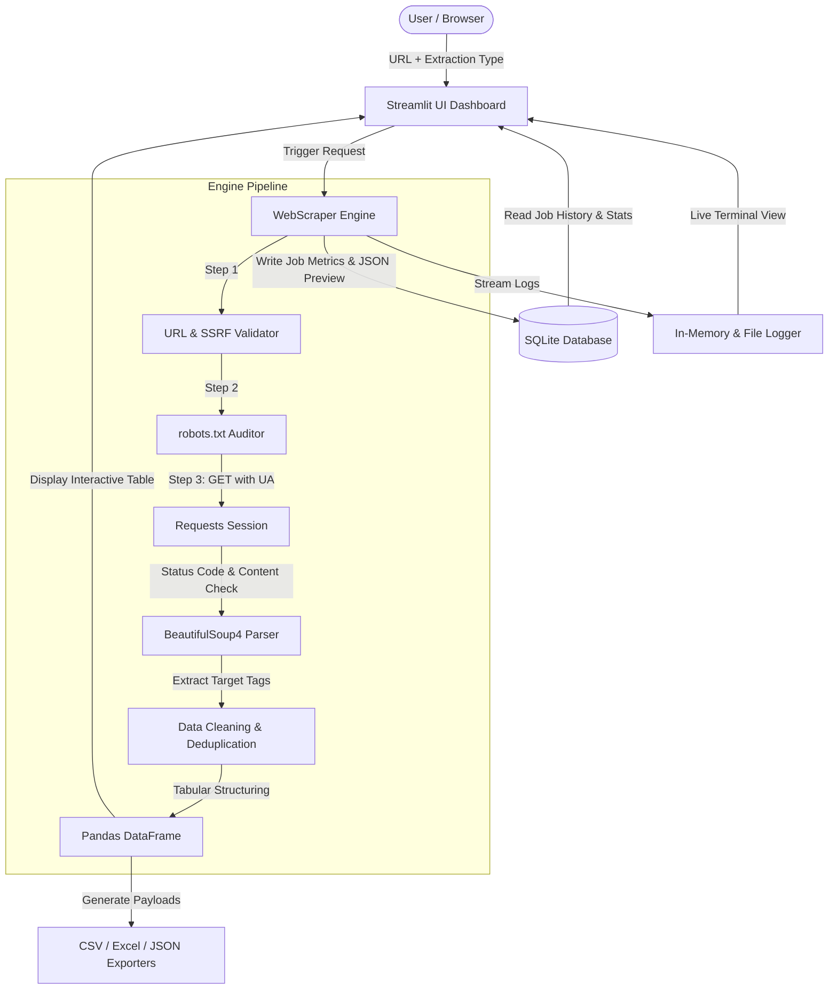

# 🕸️ Web Scraping Automation Platform

[](https://www.python.org/)
[](https://streamlit.io/)
[](https://beautiful-soup-4.readthedocs.io/)
[](https://pandas.pydata.org/)
[](https://www.sqlite.org/)
[](https://render.com/)
[](https://github.com/)

An enterprise-ready, automated web data extraction platform and interactive dashboard. Built with **Python 3.12**, **Streamlit**, **Requests**, **BeautifulSoup4**, **Pandas**, and **SQLite**, this application enables data analysts, researchers, and recruiters to extract clean, structured datasets from public web pages with one click, audit `robots.txt` compliance, monitor realtime extraction telemetry, and export results directly to **Excel (.xlsx)**, **CSV (UTF-8 BOM)**, and **JSON**.

---

## 📌 Table of Contents
- [Project Overview](#-project-overview)
- [Key Features](#-key-features)
- [Architecture & Workflow](#-architecture--workflow)
- [Tech Stack](#-tech-stack)
- [Directory Structure](#-directory-structure)
- [Installation & Local Setup](#-installation--local-setup)
- [How to Run the Application](#-how-to-run-the-application)
- [How to Use the Dashboard](#-how-to-use-the-dashboard)
- [Supported Data Extractors](#-supported-data-extractors)
- [Database & Historical Auditing](#-database--historical-auditing)
- [Error Handling & Edge Cases](#-error-handling--edge-cases)
- [Testing Suite](#-testing-suite)
- [Deploying to Render](#-deploying-to-render)
- [Ethical Scraping & Legal Compliance](#-ethical-scraping--legal-compliance)
- [Future Enhancements](#-future-enhancements)

---

## 🚀 Project Overview

Manual data collection from websites is slow, error-prone, and unscalable. The **Web Scraping Automation Platform** solves this by providing:
1. **Zero-Code Extraction**: Input a target URL, pick an extraction mode (Headings, Links, Tables, Paragraphs, Metadata, Images), and run.
2. **Instant Data Cleaning**: Eliminates excess whitespace, breaks, and removes duplicate entries automatically.
3. **Data Governance & History**: Persists every scraping run, duration, status, and data preview into an embedded SQLite database.
4. **Offline Test Bench**: Includes a built-in static HTML environment for demonstration even in restricted offline settings.
5. **Ethical Compliance**: Features an integrated `robots.txt` auditor to verify crawling permissions before execution.

---

## ✨ Key Features

- **🌐 Multi-Target Scraping Engine**: Extract Titles & Meta Descriptions, Headings (H1–H6), Links (internal/external classification), Paragraphs (word/char count stats), Tables (auto-structured header detection), and Images.
- **⚡ Interactive Streamlit Dashboard**: Sleek dark UI with metric cards, animated status indicators, and tabs.
- **📥 One-Click Multi-Format Export**:
  - **CSV**: Encoded with UTF-8 BOM (`utf-8-sig`) for Excel compatibility on Windows without mojibake/garbled text.
  - **Excel (.xlsx)**: Formatted with styled navy headers, zebra striping, and auto-fitted columns using `openpyxl`.
  - **JSON**: Clean, standardized API-ready payload.
- **📜 Live Telemetry & Console Logs**: Visual terminal container rendering real-time HTTP negotiation and parsing steps.
- **🕒 SQLite Scraping History**: Full audit trail with keyword search, status filtering, record preview, and summary analytics.
- **🛡️ Built-in robots.txt Auditor**: Automatically checks remote server crawling policies to avoid policy violations.
- **🧪 Offline Demo Playground**: Built-in test bench runs without internet access for foolproof interview demonstrations.

---

## 🏗️ Architecture & Workflow



---

## 🛠️ Tech Stack

| Component | Technology | Rationale |
|-----------|-----------|-----------|
| **Core Language** | Python 3.12+ | High readability, rich ecosystem, and async support. |
| **Frontend UI** | Streamlit | Rapid, responsive web dashboard with native Pandas integration. |
| **HTTP Client** | Requests | Battle-tested session handling, redirects, and custom headers. |
| **HTML Parser** | BeautifulSoup4 + lxml | Fast DOM parsing with flexible CSS selector fallback. |
| **Data Processing** | Pandas | High-performance tabular transformation and normalization. |
| **Excel Engine** | OpenPyXL | Programmatic cell styling, auto-column sizing, and XML packaging. |
| **Persistence** | SQLite3 | Zero-configuration relational database with ACID guarantees. |
| **Testing** | Pytest | Industry standard test runner with comprehensive assertions. |
| **Deployment** | Render / Docker | Cloud platform with automatic git-based builds via `render.yaml`. |

---

## 📁 Directory Structure

```text
web-scraping-automation/
│
├── app.py                      # Main Streamlit Dashboard Application
│
├── scraper/
│   ├── __init__.py             # Scraper module exports
│   ├── scraper.py              # Main WebScraper client and ScrapeResult dataclass
│   ├── parsers.py              # Parsers for Title, Headings, Links, Paragraphs, Tables, Images
│   └── validators.py           # URL validation, domain checking, robots.txt auditor
│
├── database/
│   ├── __init__.py
│   └── db.py                   # SQLite connection manager, queries, and aggregations
│
├── utils/
│   ├── __init__.py
│   ├── export.py               # In-memory CSV, formatted Excel (.xlsx), and JSON exporters
│   └── logger.py               # Memory buffer log handler + rotating file logger
│
├── data/
│   ├── .gitkeep
│   └── scraping_history.db     # Local SQLite database (auto-created)
│
├── logs/
│   ├── .gitkeep
│   └── scraper.log             # Persistent log file (auto-created)
│
├── demo/
│   └── demo_page.html          # Rich HTML demo page for offline test bench
│
├── tests/
│   ├── __init__.py
│   └── test_scraper.py         # Pytest test suite covering all modules
│
├── .streamlit/
│   └── config.toml             # Custom theme and server settings
│
├── .github/workflows/
│   └── ci.yml                  # GitHub Actions CI pipeline
│
├── requirements.txt            # Locked project dependencies
├── .env.example                # Example environment variables
├── .gitignore                  # Git ignore rules
├── render.yaml                 # Render Infrastructure-as-Code deploy config
└── README.md                   # Comprehensive project documentation
```

---

## ⚙️ Installation & Local Setup

### 1. Prerequisites
- Python 3.12 or higher installed ([Download Python](https://www.python.org/downloads/))
- Git installed ([Download Git](https://git-scm.com/))

### 2. Clone the Repository
```bash
git clone https://github.com/<your-username>/web-scraping-automation.git
cd web-scraping-automation
```

### 3. Create and Activate Virtual Environment
**On Windows (PowerShell):**
```powershell
python -m venv venv
.\venv\Scripts\Activate.ps1
```

**On macOS / Linux:**
```bash
python3 -m venv venv
source venv/bin/activate
```

### 4. Install Dependencies
```bash
pip install --upgrade pip
pip install -r requirements.txt
```

---

## 🖥️ How to Run the Application

Start the Streamlit dashboard by running:
```bash
streamlit run app.py
```

The application will automatically launch in your default web browser at:
`http://localhost:8501`

---

## 🎯 How to Use the Dashboard

1. **Select or Enter a Target URL**:
   - Use the **Quick Demo Targets** dropdown in the sidebar (e.g. `Quotes to Scrape`, `Books to Scrape`, `Local Demo Page`), or type any public URL.
2. **Choose Extraction Type**:
   - Select between `Headings`, `Links`, `Tables`, `Paragraphs`, `Page Title`, or `Images`.
3. **Configure Options**:
   - Adjust the **Maximum Records** slider (e.g. 50).
   - In *Advanced Settings*, configure request timeout or enable the *robots.txt Compliance* toggle.
4. **Click "🚀 Start Scraping"**:
   - Watch live logs and metrics populate in seconds.
5. **Inspect & Export**:
   - Explore the data in the interactive grid.
   - Click **Download CSV**, **Download Excel**, or **Download JSON**.
6. **Audit History**:
   - Switch to the **🕒 Scraping History** tab to review previous jobs, search domains, and inspect top-row previews.

---

## 📊 Supported Data Extractors

| Extractor | Extracted Fields | Transformations |
|-----------|-----------------|-----------------|
| **Page Title** | `Page Title`, `Length (Chars)`, `Meta Description`, `Canonical URL` | Strips extra whitespace, checks OpenGraph tags. |
| **Headings** | `Level`, `Tag` (H1–H6), `Heading Text`, `Character Count` | Deduplicates identical headings, maintains document order. |
| **Links** | `Text`, `URL`, `Type` (Internal/External), `Target` | Normalizes relative paths (`/path`) to absolute URLs (`https://...`), removes anchor hashes (`#`). |
| **Paragraphs**| `Paragraph #`, `Paragraph Text`, `Word Count`, `Character Count` | Collapses multiple newlines, filters out empty `<p>` tags. |
| **Tables** | Dynamic columns detected from `<thead>` or first `<tr>` | Handles multiple tables, fills missing cells, ensures unique column names. |
| **Images** | `Alt Text`, `Image URL`, `Type` (Internal/External) | Resolves relative image sources, ignores data URIs. |

---

## 🗄️ Database & Historical Auditing

Scraping metadata is stored in a clean SQLite database schema (`data/scraping_history.db`):

```sql
CREATE TABLE scraping_history (
    id INTEGER PRIMARY KEY AUTOINCREMENT,
    url TEXT NOT NULL,
    scrape_type TEXT NOT NULL,
    record_count INTEGER NOT NULL DEFAULT 0,
    status TEXT NOT NULL,               -- 'Success' or 'Failed'
    execution_time REAL NOT NULL,       -- in seconds (e.g. 0.42)
    timestamp TEXT NOT NULL,            -- YYYY-MM-DD HH:MM:SS
    error_message TEXT,
    preview_json TEXT                   -- JSON snippet of top 5 extracted records
);
```

---

## 🛡️ Error Handling & Edge Cases

The application replaces raw Python traceback crashes with user-friendly diagnostics:
- **Invalid / Malformed URL**: Immediate validation failure with guidance.
- **Connection Timeout**: Clear warning that target server took too long.
- **HTTP 403 Forbidden**: Informs user that the site blocked automated requests or requires authentication.
- **HTTP 404 Not Found**: Verifies that the endpoint does not exist.
- **HTTP 500+ Server Errors**: Identifies remote server outages.
- **Empty / Non-HTML Responses**: Identifies binary downloads or empty responses.
- **Zero Records Found**: Graceful warning indicating no matching tags were present.

---

## 🧪 Testing Suite

The project includes unit and integration tests using **Pytest**.

To execute the test suite:
```bash
pytest tests/ -v
```

### Test Coverage Highlights:
- ✅ URL Sanitization & Protocol Validation (valid, empty, malformed, non-HTTP).
- ✅ HTML Tag Parsers (Title, Headings H1-H6, Relative Links, Paragraphs, Tables).
- ✅ Relative URL normalization (`urljoin`) and link classification.
- ✅ Table structure parsing and column padding.
- ✅ In-memory HTML scraping engine.
- ✅ SQLite Database CRUD, filtering, stats calculations, and clean connection release.
- ✅ Multi-format export verification (UTF-8 BOM in CSV, valid ZIP signature in XLSX).

---

## ☁️ Deploying to Render

This project is configured for one-click deployment on **Render** using `render.yaml`.

### Step-by-Step Render Deployment:
1. **Push your code to GitHub**:
   ```bash
   git add .
   git commit -m "feat: complete web scraping automation platform"
   git push origin main
   ```
2. **Log into Render**:
   - Go to [dashboard.render.com](https://dashboard.render.com/) and connect your GitHub account.
3. **Create a New Web Service**:
   - Click **New +** → **Web Service**.
   - Select your `web-scraping-automation` repository.
4. **Configure Settings**:
   - **Environment**: `Python`
   - **Build Command**: `pip install -r requirements.txt`
   - **Start Command**:
     ```bash
     streamlit run app.py --server.port $PORT --server.address 0.0.0.0 --server.headless true
     ```
   - **Plan**: Free
5. **Deploy**:
   - Click **Create Web Service**. Render will install dependencies, launch Streamlit, and generate your live public URL (e.g. `https://web-scraping-automation.onrender.com`).

---

## ⚖️ Ethical Scraping & Legal Compliance

This project is strictly designed for **publicly accessible educational and research data**.
- **Robots Exclusion Standard**: Always consult and respect `/robots.txt`.
- **No Anti-Bot Evasion**: This tool does **not** bypass CAPTCHA, authentication walls, paywalls, or Cloudflare challenges.
- **Respectful Crawling**: Implements configurable timeouts and single-page requests to minimize server load.
- **Terms of Service**: Users are responsible for adhering to the target site's Terms of Use.

---

## 🔮 Future Enhancements
- [ ] Add asynchronous parallel scraping with `aiohttp` or `httpx`.
- [ ] Implement automated scheduling via APScheduler or Celery.
- [ ] Add automated Webhook / Email alerts upon data extraction completion.
- [ ] Add regex pattern matching for custom data fields (e.g. phone numbers, emails).
- [ ] Provide Dockerfile and Docker Compose setup for containerized deployment.

---

## 👤 Author & Acknowledgments
- **Project Lead**: Developed as a technical portfolio project demonstrating end-to-end Python automation, data processing, and dashboard development.
- **License**: MIT License - Free for educational and commercial use.
